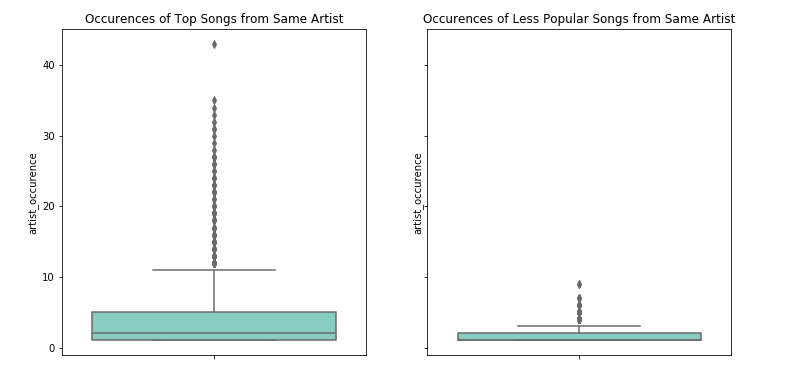

> By Cheng-Chun Lee, Sanadhi Sutandi, Skander Hajri.



### Background

Lorem ipsum dolor sit amet, consectetur adipiscing elit. Quisque id semper massa. Vivamus ultricies massa vel nisl dapibus mattis. Duis id urna elit. Vivamus dapibus tristique purus vitae rhoncus. Suspendisse bibendum eget sem non laoreet. Donec et egestas odio. Pellentesque tortor risus, dapibus finibus feugiat lobortis, mattis non ex. Integer vitae urna vitae nulla dapibus pulvinar vitae nec turpis. Donec at elementum urna. Etiam vehicula auctor velit at egestas.

<div id="pieChart"></div>


Morbi magna diam, finibus venenatis eros vitae, ultrices convallis elit. Pellentesque at faucibus dui. Vivamus bibendum placerat eros, sed cursus nisl placerat a. Maecenas maximus venenatis purus vel vestibulum. Nullam dapibus elit arcu, id commodo turpis tincidunt vitae. Ut scelerisque felis a mi interdum tempor. Vivamus ac leo semper, rhoncus dolor a, mattis lorem. Cras non tellus iaculis, rhoncus dui at, gravida augue. Cras mattis erat nec pellentesque sollicitudin. Phasellus id augue magna.

### Million Song Datasets

Lorem ipsum dolor sit amet, consectetur adipiscing elit. Quisque id semper massa. Vivamus ultricies massa vel nisl dapibus mattis. Duis id urna elit. Vivamus dapibus tristique purus vitae rhoncus. Suspendisse bibendum eget sem non laoreet. Donec et egestas odio. Pellentesque tortor risus, dapibus finibus feugiat lobortis, mattis non ex. Integer vitae urna vitae nulla dapibus pulvinar vitae nec turpis. Donec at elementum urna. Etiam vehicula auctor velit at egestas.

```js
// Javascript code with syntax highlighting.
var fun = function lang(l) {
  dateformat.i18n = require('./lang/' + l)
  return true;
}
```

<table align="center" style="text-align: center;">
  <tr>
    <th>Month</th>
    <th>Savings</th>
  </tr>
  <tr>
    <td>January</td>
    <td>$100</td>
  </tr>
  <tr>
    <td>February</td>
    <td>$80</td>
  </tr>
</table>

* * *

<h2 style="text-align: center;"> Observing Songs' Popularity </h2>

### Characteristics
Lorem ipsum dolor sit amet, consectetur adipiscing elit. Quisque id semper massa. Vivamus ultricies massa vel nisl dapibus mattis. Duis id urna elit. Vivamus dapibus tristique purus vitae rhoncus. Suspendisse bibendum eget sem non laoreet. Donec et egestas odio. Pellentesque tortor risus, dapibus finibus feugiat lobortis, mattis non ex. Integer vitae urna vitae nulla dapibus pulvinar vitae nec turpis. Donec at elementum urna. Etiam vehicula auctor velit at egestas.

Map
<iframe src="https://sanadhis.github.io/ITT-ADA-2017/project/web/maps/songs_distribution.html" width="100%" height="400">Your browser does not support iframes.</iframe>

Distributions
<div class="w3-content w3-display-container">
  
    

  <button class="w3-button w3-black w3-display-left" onclick="plusDivs(-1)">&#10094;</button>
  <button class="w3-button w3-black w3-display-right" onclick="plusDivs(1)">&#10095;</button>
</div>

### Genres over time
Lorem ipsum dolor sit amet, consectetur adipiscing elit. Quisque id semper massa. Vivamus ultricies massa vel nisl dapibus mattis. Duis id urna elit. Vivamus dapibus tristique purus vitae rhoncus. Suspendisse bibendum eget sem non laoreet. Donec et egestas odio. Pellentesque tortor risus, dapibus finibus feugiat lobortis, mattis non ex. Integer vitae urna vitae nulla dapibus pulvinar vitae nec turpis. Donec at elementum urna. Etiam vehicula auctor velit at egestas.

<div id="dropQ1" align="center"></div>
<svg width="100%" height="500" id="barChartQ1"></svg>



<div id="chart"></div>


### Herding Bias in Songs
Lorem ipsum dolor sit amet, consectetur adipiscing elit. Quisque id semper massa. Vivamus ultricies massa vel nisl dapibus mattis. Duis id urna elit. Vivamus dapibus tristique purus vitae rhoncus. Suspendisse bibendum eget sem non laoreet. Donec et egestas odio. Pellentesque tortor risus, dapibus finibus feugiat lobortis, mattis non ex. Integer vitae urna vitae nulla dapibus pulvinar vitae nec turpis. Donec at elementum urna. Etiam vehicula auctor velit at egestas.

### Tendency of Hearing Singers' Voice, not the Songs
Lorem ipsum dolor sit amet, consectetur adipiscing elit. Quisque id semper massa. Vivamus ultricies massa vel nisl dapibus mattis. Duis id urna elit. Vivamus dapibus tristique purus vitae rhoncus. Suspendisse bibendum eget sem non laoreet. Donec et egestas odio. Pellentesque tortor risus, dapibus finibus feugiat lobortis, mattis non ex. Integer vitae urna vitae nulla dapibus pulvinar vitae nec turpis. Donec at elementum urna. Etiam vehicula auctor velit at egestas.

### The Importance of First Performance
Lorem ipsum dolor sit amet, consectetur adipiscing elit. Quisque id semper massa. Vivamus ultricies massa vel nisl dapibus mattis. Duis id urna elit. Vivamus dapibus tristique purus vitae rhoncus. Suspendisse bibendum eget sem non laoreet. Donec et egestas odio. Pellentesque tortor risus, dapibus finibus feugiat lobortis, mattis non ex. Integer vitae urna vitae nulla dapibus pulvinar vitae nec turpis. Donec at elementum urna. Etiam vehicula auctor velit at egestas.

### Do people care about Lyrics?
Lorem ipsum dolor sit amet, consectetur adipiscing elit. Quisque id semper massa. Vivamus ultricies massa vel nisl dapibus mattis. Duis id urna elit. Vivamus dapibus tristique purus vitae rhoncus. Suspendisse bibendum eget sem non laoreet. Donec et egestas odio. Pellentesque tortor risus, dapibus finibus feugiat lobortis, mattis non ex. Integer vitae urna vitae nulla dapibus pulvinar vitae nec turpis. Donec at elementum urna. Etiam vehicula auctor velit at egestas.

<div id="drop" align="center"></div>
<svg width="100%" height="500" id="barChart"></svg>



### Presence of "Slank Words" in Popular Songs
Lorem ipsum dolor sit amet, consectetur adipiscing elit. Quisque id semper massa. Vivamus ultricies massa vel nisl dapibus mattis. Duis id urna elit. Vivamus dapibus tristique purus vitae rhoncus. Suspendisse bibendum eget sem non laoreet. Donec et egestas odio. Pellentesque tortor risus, dapibus finibus feugiat lobortis, mattis non ex. Integer vitae urna vitae nulla dapibus pulvinar vitae nec turpis. Donec at elementum urna. Etiam vehicula auctor velit at egestas.