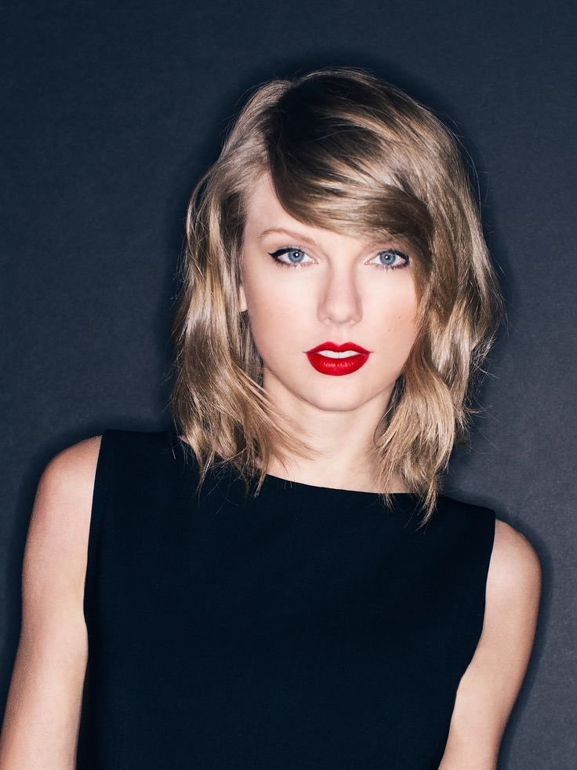

> By Cheng-Chun Lee, Sanadhi Sutandi, Skander Hajri.



### Background

Music has become one fundamental part in our daily activities. Unconsciously, we listen to music everytime and anywhere, e.g. while cooking, sitting in Rolex (either in silent area or not), coding your project, cycling to Vevey, and so on. 

* According to *[Spin](https://www.spin.com/2014/06/average-american-listening-habits-four-hours-audio-day/)*, in **average American listens to 4 hours** of music **each day**.

<blockquote cite="http://www.azquotes.com/quote/1247952">
<i>A famous violinist once said. Music transcends words. By exchanging notes, you get to know one another, to understand one another. As if your souls were connected and your hearts were overlapping. It's a conversation through instruments. A miracle that creates harmony. In that moment, music transcends words -<a href="http://www.azquotes.com/quote/1247952" target="_blank">K</a>.</i>
</blockquote>

It is widely known that music with lyrics, well known as "Songs", is one favorite way to express human emotional feelings and expressions. Song is one of the greatest creations of human kind in the course of history and now it has already been transformed into music industry.

It is exicing for us to elaborate what factors influence songs popularity at most. Thus we present the analysis of songs' popularity as our final project for *[ADA course](https://dlab.epfl.ch/teaching/fall2017/cs401/)*!

### Datasets

Throughout this project, we mainly use *[Million Song Dataset](https://labrosa.ee.columbia.edu/millionsong/)* that has collection of audio features and metadata of popular and unpopular songs. 

In addition we also utilize two additional datasets:
* [The musiXmatch Dataset](https://labrosa.ee.columbia.edu/millionsong/musixmatch): Containing lyrics.
* [The Echo Nest Taste Profile Subset](https://labrosa.ee.columbia.edu/millionsong/tasteprofile) : Containing profiles of real users with their play count.

Important fields of Million Song Dataset:
<dl>
<dt>track_id</dt>
<dd>The primary identifier field for all songs in dataset.</dd>
<dt>song_hotttnesss</dt>
<dd>the popularity of a song measured with value of between 0 - 1.</dd>
</dl>

* * *

<h2 style="text-align: center;"> Observing Songs' Popularity </h2>

### Important Features of Popular Songs
Using correlation matrix, we can briefly observe which features influences songs' popularity. Compared with other features, **artist_familiarity**, **artist_hotttnesss**, **year** have stronger correlation into **song_hotttnesss**.

In order to obtain more accurate results, we use **random forest classifier** to predict whether a song is popular/unpopular. We get a high accuracy of **97,52%** by random forest, and then we observe the attribute **feature\_importances** to see which feature matters the most. We figure out that two most important features are:
<dl>
<dt>artist_hotttnesss</dt>
<dd>The popularity of an artist (usually last for short-term)</dd>
<dt>artist_familiarity</dt>
<dd>The indication of how well-known an artist is (usually last for longer-term)</dd>
</dl>

### More into Exploratory Data Analysis
#### Same Artist and Same Release Album
Let's compare the distribution of occurence for popular and unpopular songs coming from same artist and release album in order to justify the previous results.

  
    

  <button class="w3-button w3-black w3-display-left" onclick="plusDivs(-1)">&#10094;</button>
  <button class="w3-button w3-black w3-display-right" onclick="plusDivs(1)">&#10095;</button>

While we infer that, in average, at least 4 of popular songs are coming from the same artist, we see that there is a tiny clear distinction between popular songs and unpopular songs. In average, at least a popular release album has two of its songs in popular songs list. 

This strengthen our previous analysis that an artist himself/herself (artist_hotttnesss and artist_familiriaty) gives significant correlation to the song_hotttnesss.

#### Location of Popular and Unpopular Songs Across the world
Popular = Blue, Unpopular = Green
<iframe src="https://sanadhis.github.io/ITT-ADA-2017/project/web/maps/songs_distribution.html" width="100%" height="400">Your browser does not support iframes.</iframe>
We spot for both popular and unpopular songs, they are mostly coming either from United States (Eastern America) or European Union (England). In general, songs coming from non-english countries are tend to be unpopular. There is a high possibility that audiences around the world prefer to listen for songs in English.

### Genres over time
Rock songs are favorite music for audiences from 2001-2009.

<svg width="100%" height="300" id="barChartQ1"></svg>





However, in 2010, "pop" becomes the top first popular genre. This indicate that music popularity is inconsistent and can change as time goes by.

* * *

<h2 style="text-align: center;"> Herding Bias in Songs </h2>

Have you taken a close look at your playlist? Do you notice that several songs from your playlist are actually from certain artists?

We define this phenomenon as herding bias, and we guess this phenomenon would exist because once the artist/artist gives a positive impression on users, they are more willing to listen to, or even more likely to love their songs. To measure the degree of herding bias, we use the following formula:

We analyze playlists of 1022 users, and get the following distribution (To avoid misleading in histogram, we make bins = 50 to get a higher resolution.) 

We find there 160 people out of 1022 people (only 16%) don’t have herding bias, and the median value is of herding bias is 0.38, which means there are 50% users clicking at least 38% of songs from certain artists. Is it a good thing or a bad thing? This is a subjective question, if you love to try new stuff, then don’t let herding bias constrain yourself!

### Tendency of Hearing Singers' Voice, not the Songs
Are songs from popular artists usually popular? We collect 25 popular and 20 unpopular artists in 2010, and analyze the song hotness of their songs. Surprisingly, it differs a lot!

This kind of phenomenon is like “Rich gets richer”, once you gain more connections (popularity), the more possible that your songs will be popular. Now, let’s observe the clickthrough rate of 2 popular artists in 2017: 

**Ed Sheran**:

  
 
  

**Alan Walker**:

  
 
  



### The Importance of First Performance
Do the songs in the first year matter a lot for artist? Are they key to success for artists? We observe nowadays people could get popular or famous because of single event (You always can find viral videos to watch when you are bored, right?), and hence we want to see whether this would also somehow lead to the career success of a singer. To do so, we choose several popular and unpopular artists during 1995-2000, 2000-2005 and 2005-2010, and observe the song hotness of their songs in their first year:

The scatter plot tells us artists may need to seize the opportunity in their first year because several recently popular singers make a success during their first year! Let us give 2 classical examples: Psy and Taylor Swift:

<!-- 

  
  
The Korean artist, Psy, becomes extremely popular because of the song “Gangnam Style”. On May 31, 2014, the video for “Gangnam Style” hit 2 billion views, and since then, Phy and Phy’s new songs are always popular.

  <a target="_blank" href="img/Taylor_Swift.jpg">

  
The American artist, Taylor Swift, starts her career since 2006. In 2007 and 2008, four single songs are published, "Teardrops on My Guitar", "Our Song", "Picture to Burn" and "Should've Said No" are all highly successful on Billboard Hot Country Songs chart

 -->

 The Korean artist, Psy, becomes extremely popular because of the song “Gangnam Style”. On May 31, 2014, the video for “Gangnam Style” hit 2 billion views, and since then, Phy and Phy’s new songs are always popular.

 The American artist, Taylor Swift, starts her career since 2006. In 2007 and 2008, four single songs are published, "Teardrops on My Guitar", "Our Song", "Picture to Burn" and "Should've Said No" are all highly successful on Billboard Hot Country Songs chart. 

* * *

<h2 style="text-align: center;"> Lyrics of Songs </h2>

### Do people care about Lyrics?
In this question we will try to find wether people tend to listen to songs that contains certain terms or themes and if popular songs themes differ from the ones discussed in unpopular tracks.
As a result we have produced four pairs of word clouds and bar plots :
- Top word count: we take the most recurrent word in every top/worst song and look at what are the most common top words.
- Top word weight: which is the same as the previous category but weighted using the duration of the songs.
- Full count: we consider the full lyrics dataset without taking care of hotttnesss, we’re counting all the words for every tracks and summing them.
- Top songs count: we repeat the previous operation, but this time on the top/worst songs.
The results being very similar for the popular and unpopular songs we only display the figures for the popular songs.
For the two first categories we have that the top word is by far ‘yeah'. Hence as a first conclusion we might say people do not really care about lyrics as 'yeah' isn't related to any specific topic. Appart from 'yeah' we can see a lot of top words concerning themes such as youth, the world/people, and verbs that refer to desire(wish, want…).
For the two remaining categories we have a different result. Over all the songs we can see that the most recurrent word is 'love' and there are many other high-ranked words that recall feelings (feel, like, want, baby, heart, girl...).

DISPLAY PLOTS

Next we did some sentiment analysis on the lyrics. From a list of positively/negatively connoted words we tried to determine whether a popular song is usually positive(happy) or negative(sad).



We can see that we have about 43.6% positive songs and 56.4% negative songs for the tracks with high hotttnesss and about 40% positive songs and 60% negative songs for the tracks with low hotttnesss. There again we have no significant difference between popular and unpopular songs. It might be interesting to redo the same analysis per music genre for further precision.

<svg width="100%" height="500" id="barChart"></svg>



### Presence of "Slank Words" in Popular Songs and Unpopular Songs
In this part we will focus on "slang words" such as insults or controversed subjects and gather their frequencies in popular/unpopular songs which will give us an estimation of the lyrics quality.

PIECHART ?

We have a ratio of 0.31 top songs containing bad words. For the low hotttnesss songs we can actually see that we only have 0.22 as a ratio. We can also see that some songs with a very high hotttness having 1/5 words being a slang word, so people might be more interested in borderline songs ?